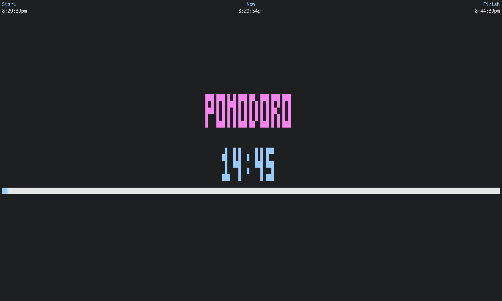

# pomodoro
Command line [pomodoro timer](https://en.wikipedia.org/wiki/Pomodoro_Technique), implemented in Go

## Installation
First install [Go](http://golang.org).

If you just want to install the binary to your current directory and don't care about the source code, run

```bash
GOBIN=$(pwd) GOPATH=/tmp/gobuild go get github.com/carlmjohnson/pomodoro
```

## Usage
```bash
$ pomodoro -simple
Start timer for 25m0s.

Countdown: 24:43

$ pomodoro -h
Usage of pomodoro:

    pomodoro [options] [pomodoroDuration] [breakDuration]

Pomodoro duration defaults to 15 minutes.
Break duration defaults to 5 minutes.
Durations may be expressed as integer minutes
(e.g. "15") or time with units (e.g. "1m30s" or "90s").

Chimes system bell at the end of the timer, unless -silent is set.
Creates a system notification at the end of the timer, unless -hidden is set.
  -silent
        Don't ring bell after countdown
  -simple
        Display simple countdown
  -hidden
        Don't show notification after countdown
```
## Screenshots

